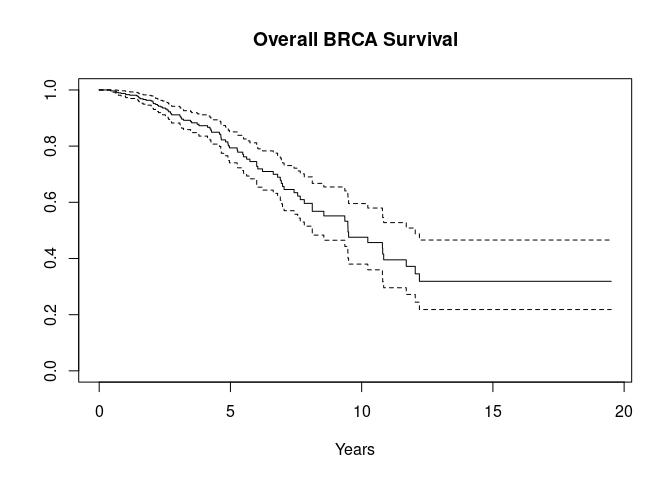
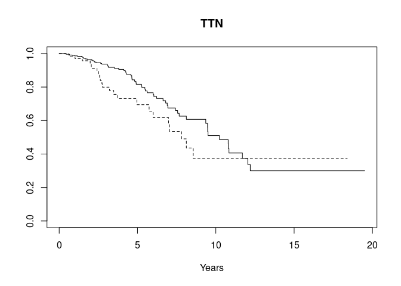
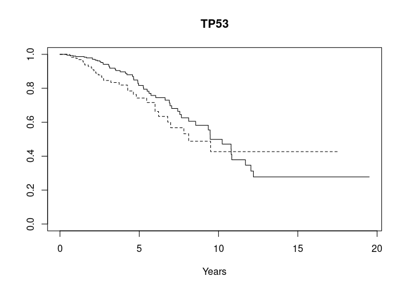
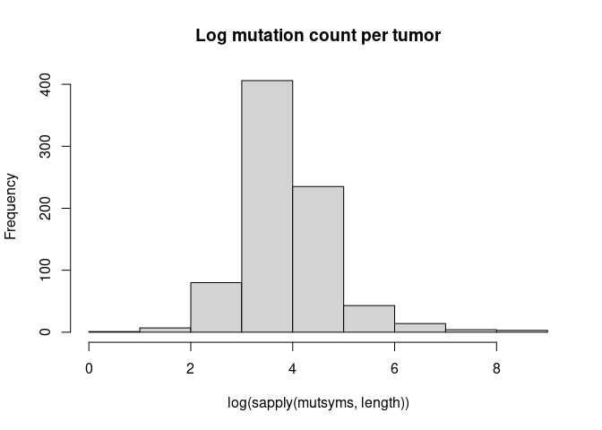
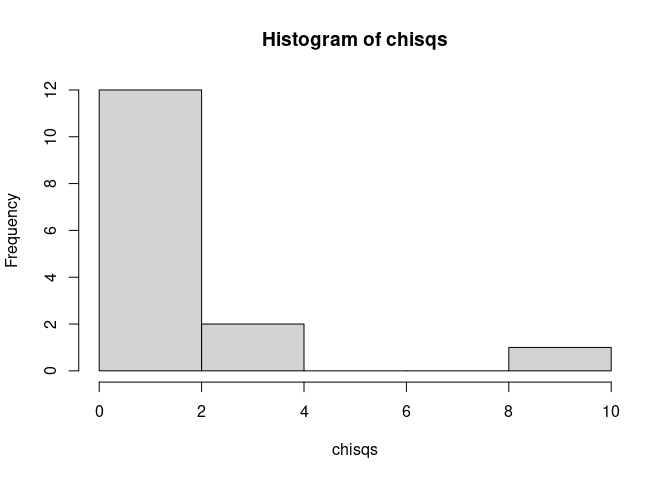
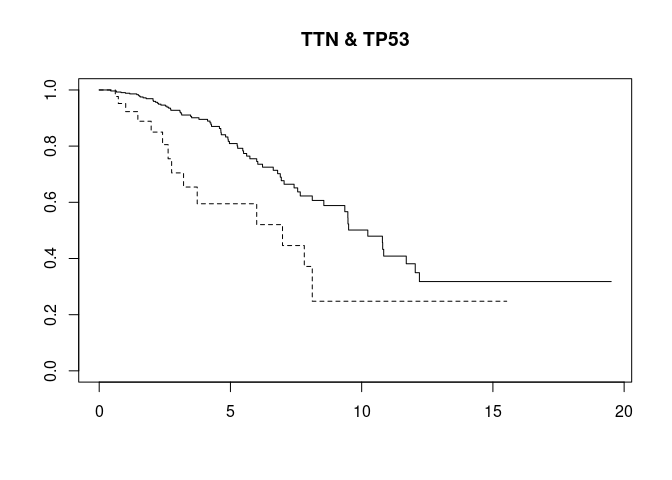

RaggedExperiment Use Case
================

This repository provides reproducible examples and tables shown in the
“RaggedExperiment: the missing link between genomic ranges and matrices
in Bioconductor” manuscript. Below is an example use case provided by
[Vincent J. Carey](mailto:stvjc@channing.harvard.edu). See the Articles
section to see other use cases and table code.

# Installation

``` r
if (!requireNamespace("RaggedExperiment", quietly = TRUE))
    install.packages("BiocManager")

BiocManager::install("RaggedExperiment")
```

# Package Load

``` r
library(curatedTCGAData)
library(TCGAutils)
library(BiocParallel)
library(survival)
library(RaggedExperiment)
```

# Enumerate mutations by symbol in BRCA, couple to overall survival

``` r
suppressMessages({
  bmut <- curatedTCGAData("BRCA", "Mutation", dry.run=FALSE, version="2.0.1")
})
sampleTables(bmut)
#> $`BRCA_Mutation-20160128`
#> 
#>  01  06 
#> 988   5
```

## Filter only for primary solid tumors (code 01)

``` r
bmut.srv <- TCGAprimaryTumors(bmut)
#> harmonizing input:
#>   removing 5 sampleMap rows with 'colname' not in colnames of experiments
sampleTables(bmut.srv)
#> $`BRCA_Mutation-20160128`
#> 
#>  01 
#> 988
```

## Extract RaggedExperiment from MultiAssayExperiment

``` r
rgmut <- bmut.srv[["BRCA_Mutation-20160128"]]
```

## Check for replicates

``` r
anyReplicated(bmut.srv)
#> BRCA_Mutation-20160128 
#>                   TRUE

## Obtain names of replicate samples by colData rowname
replicates <- Filter(length,
    lapply(
      replicated(bmut.srv)[["BRCA_Mutation-20160128"]],
      function(x) {
        colnames(rgmut)[x]
      }
    )
)
```

## Total number of patients with replicates

``` r
sum(sapply(replicated(bmut.srv), any))
#> [1] 9
## OR
length(replicates)
#> [1] 9
```

## Remove replicate observations

``` r
bmut.surv <- bmut.srv[,
    list("BRCA_Mutation-20160128" =
        !colnames(rgmut) %in% unlist(sapply(replicates, tail, -1)))
]
#> harmonizing input:
#>   removing 11 sampleMap rows with 'colname' not in colnames of experiments
stopifnot(!anyReplicated(bmut.surv))
```

## See mutation classifications

``` r
ragex <- bmut.surv[["BRCA_Mutation-20160128"]]
table(mcols(ragex)$Variant_Classification)
#> 
#>   Frame_Shift_Del   Frame_Shift_Ins      In_Frame_Del      In_Frame_Ins Missense_Mutation Nonsense_Mutation  Nonstop_Mutation               RNA            Silent 
#>              3162              2567               627               161             55063              4841               133              4474             17901 
#>       Splice_Site 
#>              1561
```

## Select only non-silent mutations

``` r
## mcolsFilter (?)
ragex <- ragex[mcols(ragex)$Variant_Classification != "Silent",  ]
table(mcols(ragex)$Variant_Classification)
#> 
#>   Frame_Shift_Del   Frame_Shift_Ins      In_Frame_Del      In_Frame_Ins Missense_Mutation Nonsense_Mutation  Nonstop_Mutation               RNA       Splice_Site 
#>              3162              2567               627               161             55063              4841               133              4474              1561
bmut[["BRCA_Mutation-20160128"]] <- ragex
#> harmonizing input:
#>   removing 16 sampleMap rows with 'colname' not in colnames of experiments
```

## Set up survival time

``` r
colData(bmut.surv) <- colData(bmut)[!is.na(bmut$OS.Time), ]
#> harmonizing input:
#>   removing 184 sampleMap rows with 'primary' not in colData
osurv <- Surv(bmut.surv$OS.Time/365.25, bmut.surv$OS.event)
```

## Obtain Hugo_Symbols for each sample

``` r
system.time({
    mutsyms <- as(
        lapply(
          as(bmut.surv[["BRCA_Mutation-20160128"]], "GRangesList"),
          function(x) x$Hugo_Symbol
        ),
        "CharacterList"
    )
})
#>    user  system elapsed 
#>   3.349   0.000   3.349
mutsyms
#> CharacterList of length 793
#> [["TCGA-A1-A0SB-01A-11D-A142-09"]] ABLIM1 ADAMTS20 CADM2 DTNB ENSG00000267261 MSH3 MYB NPIPL2 OR11H1 OTOR P2RY10 PIEZO1 SLC6A9 SOX15 SPTB TMEM247 ZNF566 ZNF574 ZNF777
#> [["TCGA-A1-A0SD-01A-11D-A10Y-09"]] ANK3 CASK CNTFR CPEB2 CSTL1 CXorf58 DCAF8 FAM182B GATA3 HECTD4 ... SLC44A3 SLFN14 SNX5 STK11IP SYNE1 TLR5 WDR72 ZFP91 ZNF544 ZNF740
#> [["TCGA-A1-A0SE-01A-11D-A099-09"]] APLF ARRDC4 B3GNT1 C3orf38 CDH1 DCDC2B FAM102A FAM102A FHL1 IMPDH2 ... SDR16C5 SYDE2 TBC1D12 TBL1X UNC13C WDR86 WDR91 ZFHX4 ZNF541
#> [["TCGA-A1-A0SF-01A-11D-A142-09"]] ACRBP ARL6IP6 BEST3 C9orf43 CECR2 CUL7 DDX53 DUSP27 EPPK1 EXT2 FIGN ... PTPRD RIT2 SFMBT2 SKOR1 SPPL2C ST7 TP73 TPH1 UBE2QL1 ZNF91
#> [["TCGA-A1-A0SG-01A-11D-A142-09"]] ARC BPIFB3 C2orf73 CECR2 CEP290 CSMD2 DSCAM DYSF ERN1 EWSR1 ... PADI2 PPID RNA5-8SP6 SCN7A SLC29A2 SYNPO2L TMEM99 TYSND1 ZNF217
#> [["TCGA-A1-A0SH-01A-11D-A099-09"]] ACSL4 AHCTF1 ALPK3 ANK3 ANKRD7 APOBR ARHGAP28 ASL ATPIF1 BDP1 ... TIFAB TMC8 TTC39A UNC93B1 UPRT USH2A WDR7 WDR87 ZFHX4 ZNF606
#> [["TCGA-A1-A0SI-01A-11D-A142-09"]] ABAT ABCA8 ACAN ACPP ACTR3B ADCK3 AGFG2 AHNAK AKR1C1 AKT2 ... ZNF345 ZNF366 ZNF419 ZNF436 ZNF436 ZNF518A ZNF673 ZNF701 ZNF790
#> [["TCGA-A1-A0SJ-01A-11D-A099-09"]] ALG1 AMZ2 ASCL3 CHML CILP COL20A1 ENSG00000235041 FAF2 FAM115C GJB2 ... RANBP6 SCN4A SNAI1 SPEN TH1L TRBV6-8 UBAP1L ZBTB11 ZNF543
#> [["TCGA-A1-A0SK-01A-12D-A099-09"]] ABCA11P ACBD5 AHNAK ALMS1P ANKRD36B ANKRD42 ARHGAP42 ARL11 ASB10 ... YIPF7 YTHDF2 ZNF234 ZNF417 ZNF469 ZNF469 ZNF66P ZNF717 ZNF777
#> [["TCGA-A1-A0SM-01A-11D-A099-09"]] AHDC1 ATP1A4 CLEC12A CP CSMD1 DCST1 EGR3 ESYT1 GOLGA3 HEATR4 ... SEZ6L2 SMARCA1 STEAP2 TBC1D8 TCTE1 TSNARE1 ZAN ZNF229 ZNF804B
#> ...
#> <783 more elements>
```

## Sample mutations tally

``` r
system.time({
  print(table(sapply(mutsyms, function(x) sum(duplicated(x)))))
})
#> 
#>    0    1    2    3    4    5    6    7    8    9   10   11   12   14   15   16   17   20   21   22   23   24   25   26   27   28   29   30   31   32   33   37   39 
#>  354  184   80   45   24   18    7    5    6    1    2    1    4    1    1    2    2    2    2    2    1    2    2    1    1    2    2    2    1    2    3    1    1 
#>   48   49   51   52   57   64   66   70   72   73   79   83   90   91   95   96  102  104  136  166  170  221  264  726 1009 1469 
#>    1    1    2    1    2    1    1    1    1    1    1    1    1    1    1    1    2    1    1    1    1    1    1    1    1    1
#>    user  system elapsed 
#>   0.030   0.062   0.092
```

## Plot overall survival curve

``` r
plot(survfit(osurv~1), main = "Overall BRCA Survival", xlab = "Years")
```



## Compare to GDC Data Portal plot

The display, based on 793 observations with non-missing TCGA OS.Time, is
consistent with the display at the [GDC Data
Portal](https://portal.gdc.cancer.gov/exploration?filters=%7B%22op%22%3A%22and%22%2C%22content%22%3A%5B%7B%22content%22%3A%7B%22field%22%3A%22cases.diagnoses.tissue_or_organ_of_origin%22%2C%22value%22%3A%5B%22axillary%20tail%20of%20breast%22%2C%22breast%2C%20nos%22%2C%22central%20portion%20of%20breast%22%2C%22lower-inner%20quadrant%20of%20breast%22%2C%22lower-outer%20quadrant%20of%20breast%22%2C%22nipple%22%2C%22overlapping%20lesion%20of%20breast%22%2C%22upper-inner%20quadrant%20of%20breast%22%2C%22upper-outer%20quadrant%20of%20breast%22%5D%7D%2C%22op%22%3A%22in%22%7D%2C%7B%22content%22%3A%7B%22field%22%3A%22cases.primary_site%22%2C%22value%22%3A%5B%22breast%22%5D%7D%2C%22op%22%3A%22in%22%7D%2C%7B%22op%22%3A%22in%22%2C%22content%22%3A%7B%22field%22%3A%22cases.project.program.name%22%2C%22value%22%3A%5B%22TCGA%22%5D%7D%7D%5D%7D&searchTableTab=genes),
based on 1077 cases.

# Obtain gene-stratified survival

``` r
gstrat <- function(sym="TTN", mutlist, survdat) {
  stopifnot(inherits(survdat, "Surv"))
  stopifnot(length(survdat) == length(mutlist))
  hassym <- unlist(list(sym) %in% mutlist)
  plot(survfit(survdat~hassym), main=sym, lty=1:2, xlab="Years")
}

gstrat("TTN", mutsyms, osurv)
```



``` r
gstrat("TP53", mutsyms, osurv)
```



## Frequencies

``` r
commut <- head(sort(table(unlist(mutsyms)), decreasing = TRUE), 30)
commut
#> 
#>  PIK3CA     TTN    TP53   MUC16   GATA3  MAP3K1   MUC12    MLL3    MUC4   SYNE1    CDH1    RYR2 CROCCP2     DST     FLG     DMD    SPEN   FCGBP   USH2A   HMCN1 
#>     312     300     272     134      97      91      78      75      69      65      64      62      58      58      56      52      52      51      51      50 
#>    RYR3   SYNE2   AHNAK   MUC5B     NEB   OBSCN  AHNAK2    APOB   XIRP2    HRNR 
#>      50      50      48      48      47      47      46      45      45      43
```

## Log mutation count per tumor

``` r
hist(log(sapply(mutsyms,length)), main="Log mutation count per tumor")
```



# Combinations of mutations

``` r
hasmut <- function(sym="TP53", mutlist) {
    sapply(mutlist, function(x) sym %in% x)
}
table(hasmut("TP53", mutsyms), hasmut("PIK3CA", mutsyms))
#>        
#>         FALSE TRUE
#>   FALSE   341  198
#>   TRUE    192   62
```

## Assemble pairs

``` r
common_pairs <- combn(names(commut),2)
common_pairs[,1:4]
#>      [,1]     [,2]     [,3]     [,4]    
#> [1,] "PIK3CA" "PIK3CA" "PIK3CA" "PIK3CA"
#> [2,] "TTN"    "TP53"   "MUC16"  "GATA3"
```

## Greedy search for deleterious pairs

``` r
indicate_pair <- function(sym1, sym2, mutlist)
  hasmut(sym1, mutlist) & hasmut(sym2, mutlist)
chk <- apply(common_pairs,2,function(z) indicate_pair(z[1], z[2], mutsyms))
chkp.inds <- which(apply(chk,2,sum)>20) # disallow very rare combos
dim(chk)
#> [1] 793 435
dim(chk[,chkp.inds])
#> [1] 793  15
chisqs <- apply(chk[,chkp.inds],2,function(z)survdiff(osurv~z)$chisq)
hist(chisqs)
```



``` r
cpr <- common_pairs[,chkp.inds][, which(chisqs>5)]
plot(survfit(osurv~chk[,chkp.inds[which(chisqs>5)]]), lty=1:2, main=paste(cpr, collapse=" & " ))
```



# Using domain classification of mutations

``` r
dom <- assay(bmut.surv[[1L]], "domain_WU")
length(grep("Znf", na.omit(as.character(dom)))) # frequently noted
#> [1] 1857
register(MulticoreParam(parallel::detectCores() - 1L))
system.time(
    mutdoms <- bplapply(
        seq_len(ncol(dom)),
        function(x) as.character(na.omit(dom[,x]))
    )
)
#>    user  system elapsed 
#>   0.172   2.421   3.241
```

## Isolate individuals with mutations

### Znf domain

``` r
noz <- sapply(mutdoms, function(x) length(grep("Znf", x))==0)
table(noz)
#> noz
#> FALSE  TRUE 
#>   520   273
survdiff(osurv~noz)
#> Call:
#> survdiff(formula = osurv ~ noz)
#> 
#>             N Observed Expected (O-E)^2/E (O-E)^2/V
#> noz=FALSE 520       51     50.1    0.0168    0.0395
#> noz=TRUE  273       37     37.9    0.0221    0.0395
#> 
#>  Chisq= 0  on 1 degrees of freedom, p= 0.8
```

### SH3

``` r
nosh3 <- sapply(mutdoms, function(x) length(grep("SH3", x))==0)
survdiff(osurv~nosh3)
#> Call:
#> survdiff(formula = osurv ~ nosh3)
#> 
#>               N Observed Expected (O-E)^2/E (O-E)^2/V
#> nosh3=FALSE 109        8     8.32   0.01215    0.0136
#> nosh3=TRUE  684       80    79.68   0.00127    0.0136
#> 
#>  Chisq= 0  on 1 degrees of freedom, p= 0.9
```
